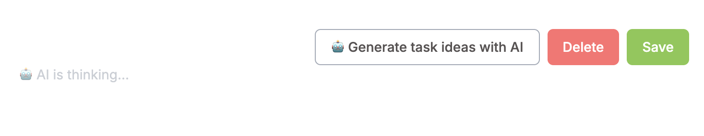
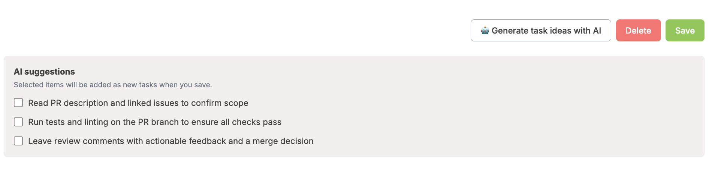
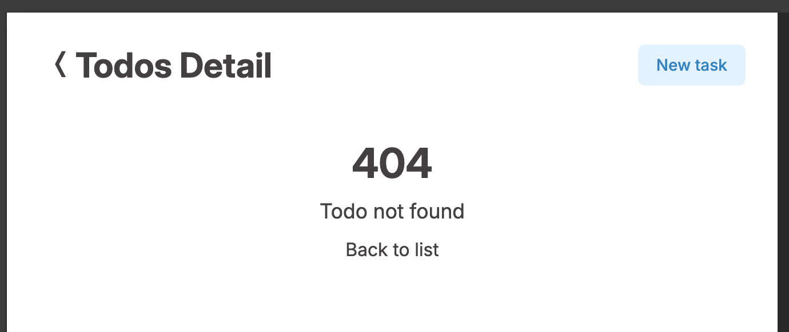

# 📝 Todo App with Remix-Inspired Architecture

A modular React app built with server-driven data flows using React Router v7, TypeScript, and React Hook Form.

> 📘 [Japanese README](./docs/readme-ja.md)

## 📸 Demo

🔗 [Todo App Demo](https://todo-app-ivory-pi-75.vercel.app/todos)

## 🧭 Overview

This app uses **React Router’s Data APIs** (`loader` and `action`) to handle data fetching and mutations like a backend.
Reusable UI components are developed and tested in **Storybook** for scalability and maintainability.

## ⚙️ Tech Stack

- **React 19**
- **React Router v7.10.1**
- **TypeScript**
- **React Hook Form** + **Zod**
- **Storybook v10.1.10**
- **Vitest** / **React Testing Library**
- **GitHub Actions** (CI/CD)
- **Vercel** (Hosting / Deployment)

## ✨ Features

- ✅ View list of todos
- 🆕 Create new todo
- 🔍 View and edit todo details
  - 🗑️ Delete todo
  - ✏️ Update todo

### 📋 Todo List (Desktop View)

- Displays todos in a table format
- Status is color-coded with labels
- Includes a button to create a new todo


### 📋 Todo List (Mobile View)

- Fully responsive design
- Optimized for single-column layout on small screens


### 📝 Create New Todo

- Input fields for title, status, and content
- Built-in validation for each field
- Save button triggers the submission process


### 🧾 Validation Errors (Create / Detail Page)

- Save button triggers the submission process
- Includes buttons to delete or save


### ⚠️ Validation Errors (Create / Detail Page)

- Errors are shown when fields are empty or exceed length limits
- Field-specific error messages are clearly displayed


### 🗑️ Delete Confirmation Modal

- Modal appears when attempting to delete a todo
- Includes Cancel and Delete buttons


### 🤖 AI-assisted Task Suggestions

On both the create and detail pages, you can generate task ideas using AI
based on the current todo title.

- Generate AI-powered task suggestions with a single click
- AI suggests related or follow-up tasks based on the title
- Select suggestions and save them as new todos
- Clear toast feedback is shown when AI-generated tasks are successfully added

This feature helps users break down tasks and think about next actions more easily.




AI features are implemented using React Router actions.
All OpenAI API calls are executed on the server side to ensure
that API keys are never exposed to the client.

## 🗺️ Routing

| Page        | Path         |
| ----------- | ------------ |
| Todo List   | `/todos`     |
| Todo Detail | `/todos/:id` |
| Create Todo | `/todos/new` |

## 📁 Project Structure

```bash
app/
├── app.css            # Global CSS styles
├── constants/         # Domain constants (e.g. paths, status)
├── features/          # Feature-scoped UI logic (components, hooks)
├── root.tsx           # Application entry point
├── routes/            # Page routes with loader/action logic
├── routes.ts          # Route path definitions for use in navigation
├── schemas/           # Zod validation schemas
├── server/            # Mock server-side business logic
├── setup-tests.ts     # Test setup (e.g. importing jest-dom)
├── types/             # Shared TypeScript types (e.g. task types)
└── utils/             # Utility functions (formatting, route labels, etc.)
```

👉 For more details: [📐 Architecture & Structure](#-architecture--project-structure)

## 🧩 UI Components (Storybook)

A set of reusable and purely presentational components developed with Storybook.

```bash
stories/
├── button
├── input
├── select
├── textarea
├── modal
├── toast
├── loading
├── status-label
└── suspense
```

### Design Policy

- Pure UI components only
- No business logic or side effects
- Easily testable and visually documented in Storybook

## 🧰 Shared Utilities (`app/utils`)

```bash
utils/
├── format-date.ts         # Format timestamps
├── task-status.ts         # Helpers for task status labels
├── test-router-args.ts    # Test helpers for routing
└── *.test.ts              # Unit tests for utilities
```

## 🏗️ Architecture

This app adopts **React Router’s Data Router model**, clearly separating:

- 📡 Routing logic (`loader` / `action`)
- 🧠 Business logic (`server/`)
- 🖼️ UI logic and presentation (`features/`, `stories/`)

## 📐 Architecture & Project Structure

Details about the architectural approach and directory structure can be found below:

📄 English: [docs/structure.md](./docs/structure.md)  
📄 Japanese: [docs/structure-ja.md](./docs/structure-ja.md)

In addition, the relationships between configuration files used by TypeScript, ESLint, and build tools are documented here:

📄 [Config Architecture Overview](./docs/config-overview.md)

## 🚀 Getting Started

```bash
git clone https://github.com/your-name/todo-app.git
cd todo-app
npm install
npm run dev
```

## 🧪 Running Tests

```bash
npm run test
```

- Unit testing: `Vitest`
- Component testing: `@testing-library/react`
- Route-level loader and action tests are also implemented

## 🔄 CI / Quality

- Automated testing via **GitHub Actions**
- Tests run on every PR to prevent regressions
- Integrated **ESLint (Flat Config)** for static code analysis in CI
  - Applies key rules like `no-unused-vars`, `prefer-const`, `eqeqeq`, `jsx-key`, etc.
  - Configured for **TypeScript** and **React**, with focus on reusability and maintainability

## 🧼 Running Lint (ESLint)

```bash
npx eslint .
```

- Uses ESLint with Flat Config for both JS/TS and React
- Linting is also executed automatically via GitHub Actions

📄 [View ESLint Config](./eslint.config.ts)

## 🧠 Key Concepts

- **🔗 Routes = HTTP Handlers**
  `loader` / `action` return data or `Response` objects, similar to backend endpoints.

- **🧩 Server Logic Isolation**
  Business logic is placed in `app/server/` for clean separation.

- **🖼️ Presentation-Only UI**
  Reusable UI components don't include business logic or state management.

### 🎨 UI Library Choice

This app uses pure Tailwind CSS for all UI styling, without relying on component libraries like Mantine.

While UI frameworks can speed up development, I intentionally avoided them to reduce potential risks from future breaking changes or version mismatches during upgrades. This approach improves long-term maintainability and consistency.

## ⚠️ Error Handling Strategy

This strategy helps keep error behavior predictable, testable, and aligned with user experience.

This application applies different error-handling strategies depending on the responsibility and context of each route.

### Loader Errors (Data Fetching)

Loaders treat data-fetching failures as **HTTP-level errors**.

- Loaders throw `Response` objects to represent HTTP errors
- `404 Not Found` is used when a requested resource does not exist
- Unexpected or system-level errors are normalized into
  `500 Internal Server Error`

A shared utility is used to preserve intentionally thrown HTTP errors
(e.g. 404 responses), while converting unknown failures into a 500 response.

### Action Errors (User Actions)

Errors caused by user interactions (create, update, delete)
are **returned as structured data**, rather than throwing `Response` objects.

This allows the UI to:

- Stay on the same page
- Preserve form state
- Display contextual feedback via toast messages

This approach improves user experience by avoiding unnecessary page transitions.

### Error Boundaries

- Detail pages use **route-level error boundaries** to display
  tailored error screens based on HTTP status codes (404 / 500)
- In the case of `404` (e.g. _Todo not found_), a clear navigation path
  back to the list page is provided
- List pages use a generic fallback UI for system-level failures
- Layout routes do not define custom error boundaries,
  as they do not perform data fetching or side effects



## 🔁 Data Flow Example: `/todos/new`

1. User submits the todo creation form
2. `action` handles the POST request
3. Calls `create-task.ts` (server logic)
4. On success → Redirects to `/todos/:id`
5. On failure → Returns structured validation errors to the UI

## ✍️ What I Learned

- Built a **React app using Remix-like architecture**
- Implemented **server-driven data flow** with `loader` and `action`
- Applied **separation of concerns** for scalability and clarity
- Developed a **Storybook-driven UI system**
- Ensured a **testable structure** with unit and integration tests

## 🗺️ Figma UI Planning

Before implementation, UI behavior was visualized in Figma to clarify specifications.

- Defined page responsibilities and transitions
- Mapped status color logic and button behavior
- Designed toasts and modal flows

🔗 [View the Figma design](https://www.figma.com/design/oBFz8dScJn1BJ1qdgsV4p4/TODO?node-id=0-1&t=ZTjQpuCXUlaOJeoS-1)


## 📄 Other Docs

- [🧭 Architecture (EN)](./docs/structure.md)
- [🧭 Architecture (JA)](./docs/structure-ja.md)
- [📘 README (JA)](./docs/readme-ja.md)
