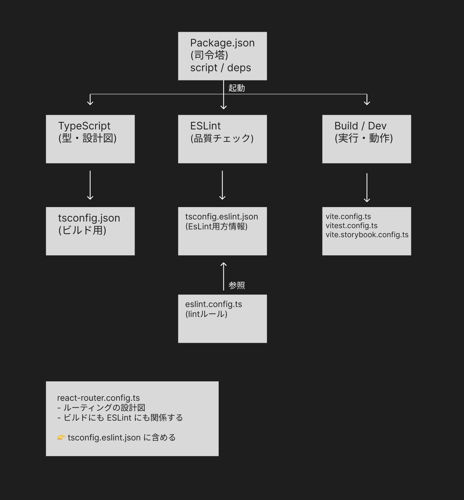

# Config ファイルの関係性

## このドキュメントについて

このドキュメントは、本プロジェクトで使用している **各種 config ファイルの役割と関係性**を整理するためのメモです。
特に、TypeScript・ESLint・Build ツールがどのように連携しているかを理解することを目的としています。

## 対象となる config ファイル

本ドキュメントでは、以下の config ファイルを対象としています。

```
├── package.json
├── tsconfig.eslint.json
├── tsconfig.json
├── vite.config.ts
├── vite.storybook.config.ts
└── vitest.config.ts
```

## なぜ config を分けているのか

このプロジェクトでは、ツールごとに config ファイルを分離しています。

理由は以下の通り:

- 各ツールの責務を明確にするため
- ESLint の型付きルール（typed linting）を安全に使うため
- 設定の影響範囲を限定し、意図しない副作用を防ぐため

config ファイル同士は「同列」ではなく、**それぞれ別のツール(ESLint, storybook, vite ...)に仕えています**。

## 全体像



この図では、以下の点を表しています。

- `package.json` がツールの起動を管理していること
- TypeScript / ESLint / Build ツールがそれぞれ独立した世界を持っていること
- ESLint が TypeScript の設定を「継承」しているのではなく、「参照」しているだけであること

## package.json の役割

`package.json` は **アプリケーションの司令塔**です。

- 使用するツールの定義
- 各ツールの起動方法（scripts）
- 依存関係の管理

`package.json` 自体は、各ツールの **詳細な設定は持ちません**。

## TypeScript の設定（tsconfig）

### tsconfig.json

`tsconfig.json` は、**アプリケーションをビルド・型チェックするための TypeScript の設計図**です。

- 本番コードが対象
- TypeScript Compiler が直接読み込む
- ビルドに関係するファイルのみを含める

### tsconfig.eslint.json

`tsconfig.eslint.json` は、**ESLint が型情報を利用するためだけの tsconfig**です。

- Storybook
- config ファイル
- scripts
- テスト関連ファイル

など、ESLint が lint 対象とするファイルを広く含めています。

この tsconfig は **ビルドには使用されません**。ESLint が型情報を得るためにだけ使用する。（この tsconfig を変更しても、アプリの挙動やビルド結果には影響しません）

また、`tsconfig.eslint.json` は `tsconfig.json` を `extends` し、
TypeScript の設定（compilerOptions など）を受け継いでいる。

## ESLint の設定（eslint.config.ts）

`eslint.config.ts` は、**コードの品質ルールを定義するファイル**です。

- 使用する ESLint ルール
- parser の設定
- 参照する tsconfig の指定

```ts
parserOptions: {
  project: "./tsconfig.eslint.json";
}
```

ここで指定しているのは、

> ESLint が TypeScript に
> 「この tsconfig を使って型情報を提供してほしい」

という依頼です。

ESLint は tsconfig の中身を解釈・継承するわけではありません。

## Build / Dev 系の config ファイル

以下の config ファイルは、run dev / run build / run test 時に **実行される設定**です。

- `vite.config.ts`
- `vite.storybook.config.ts`
- `vitest.config.ts`

これらは、

- import が必要
- 条件分岐が必要
- 実行環境に依存する処理がある

ため、TS / JS で記述されています。

### 例 : npm run dev

```
"dev": "vite"
```

```
npm run dev
  ↓
vite コマンド
  ↓
vite.config.ts を読み込む
  ↓
export default defineConfig(...) を実行
  ↓
開発サーバー起動

```

これらの config ファイルは、ツール起動時に Node.js 上で読み込まれ、
設定オブジェクトや関数が実行されます。

## react-router.config.ts について

`react-router.config.ts` は、React Router の動作方針（SSR / SPA など）を定義する設定ファイルです。

- React Router のビルド / 開発プロセスで参照される設定
- TypeScript ファイルで、型定義（Config）を使用している
- ESLint の lint 対象に含めたい設定ファイル

そのため、アプリ本体のビルドと型チェックを担う `tsconfig.json` ではなく、
ESLint が型情報を取得するための `tsconfig.eslint.json` に含めています。

## まとめ

- config ファイル同士に親子関係はない
- それぞれが **別のツールに仕えている**
- TypeScript の tsconfig は「実行されない設計図」
- `.config.ts` は「実行される設定」

この分離によって、設定の見通しを良くし、将来的な変更にも対応しやすくしています。

### ✏️ メモ（自分用）

このドキュメントは、config の理解を深めるための記録であり、
将来的にツール構成が変わった際にも応用できる考え方を整理したものです。
