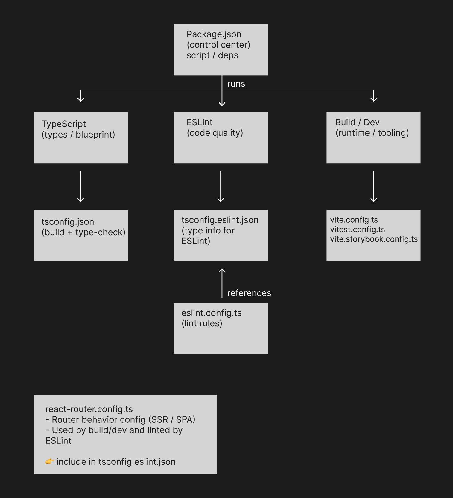

# Configuration Architecture

## About this document

This document explains the **roles and relationships of configuration files** used in this project.

The goal is to clarify how **TypeScript, ESLint, and Build / Dev tools** interact, and why their configurations are intentionally separated.

## Why configurations are separated

Each tool in this project has a different responsibility, so configuration files are split accordingly.

This separation helps to:

- Keep each tool’s responsibility clear
- Safely use ESLint’s type-aware rules (typed linting)
- Limit the impact of configuration changes and avoid unintended side effects

Configuration files are **not siblings** —
each one serves a **different tool**.

## High-level overview



This diagram shows that:

- `package.json` acts as the entry point that starts each tool
- TypeScript, ESLint, and Build / Dev tools operate in separate domains
- ESLint does **not inherit** TypeScript settings — it only **references** them

## package.json

`package.json` acts as the **control center** of the project.

It defines:

- Which tools are used
- How they are executed (`scripts`)
- Project dependencies

It does **not** contain detailed configuration for each tool.

## TypeScript configuration

### tsconfig.json

`tsconfig.json` defines the **TypeScript program for the application itself**.

- Used for building and type-checking production code
- Read directly by the TypeScript compiler
- Includes only files related to the application

This file represents the **static design rules** of the TypeScript codebase.

### tsconfig.eslint.json

`tsconfig.eslint.json` exists **only to provide type information to ESLint**.

It includes files that should be linted but are not part of the application build, such as:

- Storybook files
- Configuration files
- Test-related files

This tsconfig is **not used for building the application**.
Changing it does not affect runtime behavior or build output.

It extends `tsconfig.json` to reuse shared TypeScript settings.

## ESLint configuration

`eslint.config.ts` defines **code quality rules**.

It specifies:

- ESLint rules
- The parser used to read TypeScript
- Which tsconfig should be referenced for type information

```ts
parserOptions: {
  project: "./tsconfig.eslint.json";
}
```

This tells ESLint:

> “Use this tsconfig to obtain type information from TypeScript.”

ESLint does **not** interpret or inherit tsconfig settings itself —
it only requests type information from the TypeScript compiler.

## Build / Dev configurations

The following config files are **executed at runtime** when running commands such as
`npm run dev`, `npm run build`, or `npm run test`:

- `vite.config.ts`
- `vite.storybook.config.ts`
- `vitest.config.ts`

These files are written in TS / JS because they:

- Use imports
- Contain conditional logic
- Depend on the execution environment

They are executed by Node.js when the corresponding tool starts.

## react-router.config.ts

`react-router.config.ts` defines **runtime behavior for React Router** (e.g. SSR vs SPA).

- Referenced during React Router’s build / dev process
- Written in TypeScript and uses typed configuration
- Included in ESLint’s lint targets

For this reason, it is included in `tsconfig.eslint.json`,
not in the application’s build-focused `tsconfig.json`.

## Summary

- Configuration files do not form a parent-child hierarchy
- Each file serves a specific tool
- `tsconfig.json` is a **static design blueprint**
- `.config.ts` files are **executed settings**

This structure keeps responsibilities clear and makes the project easier to maintain as it grows.
