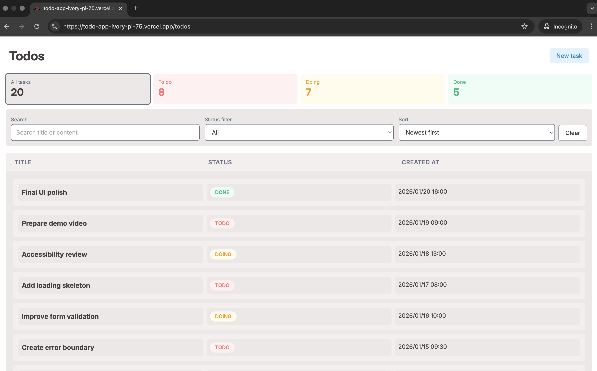
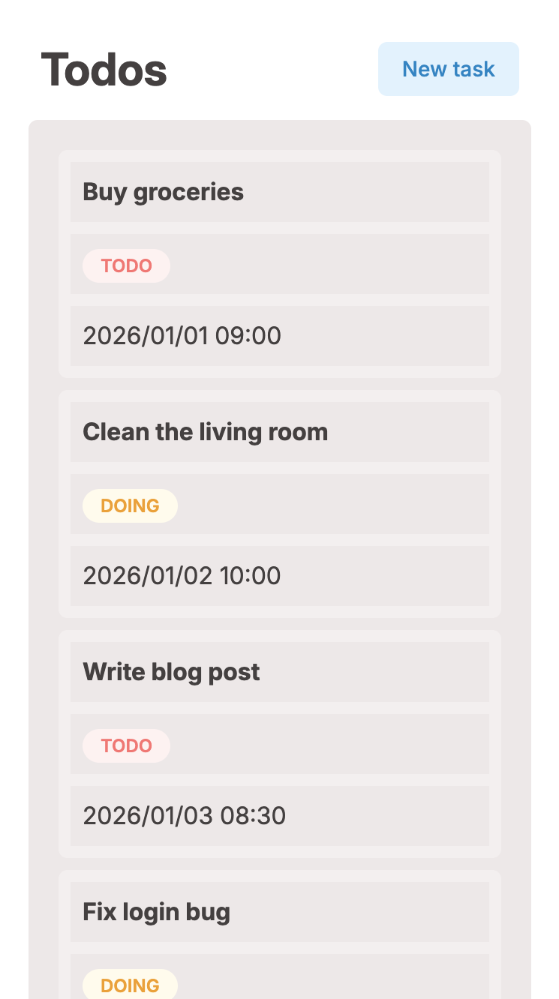
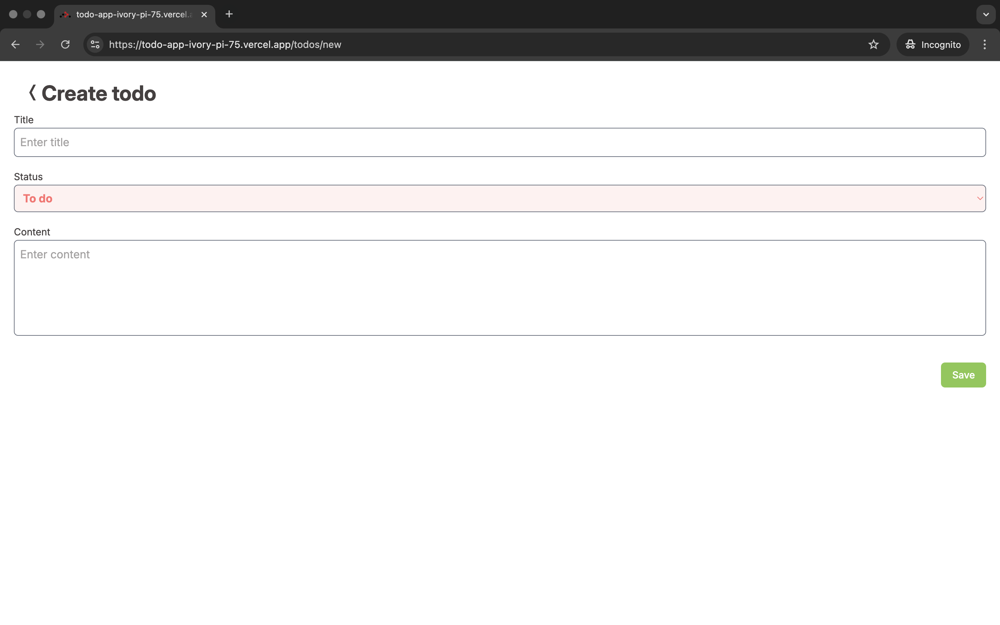
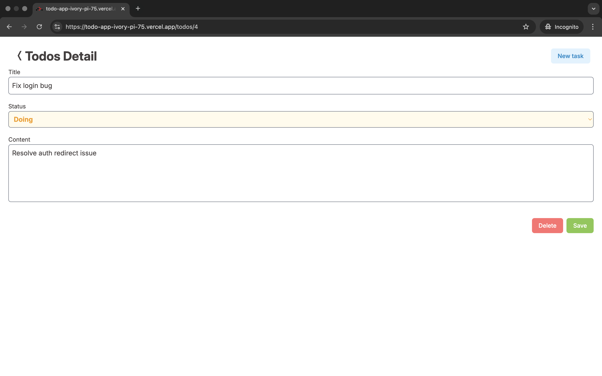
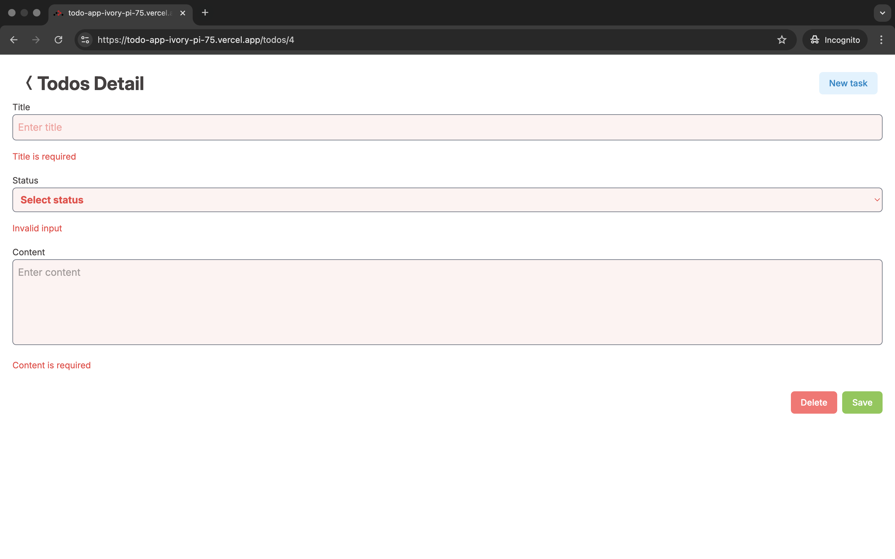
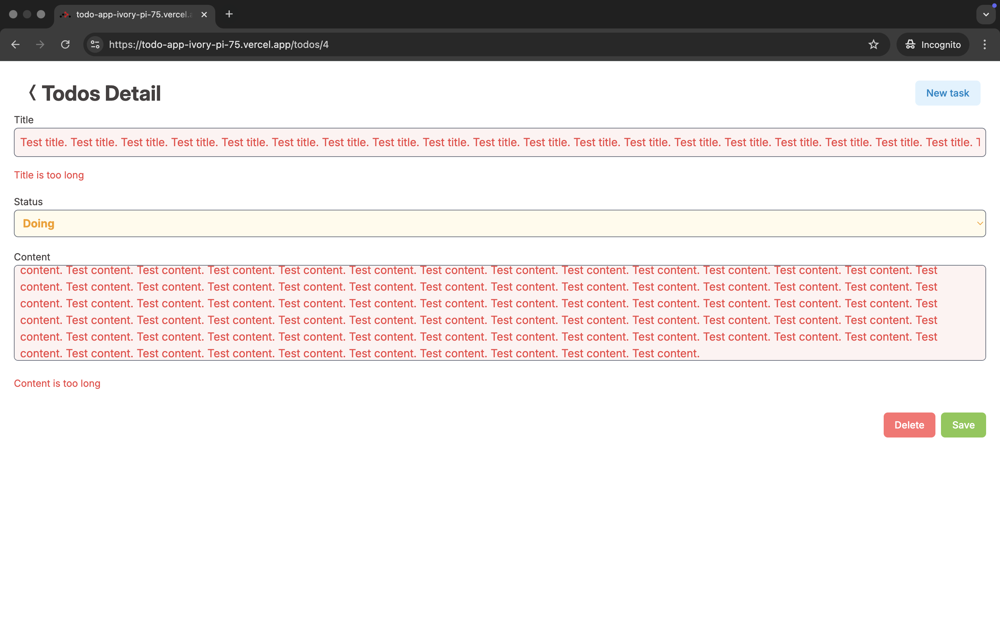
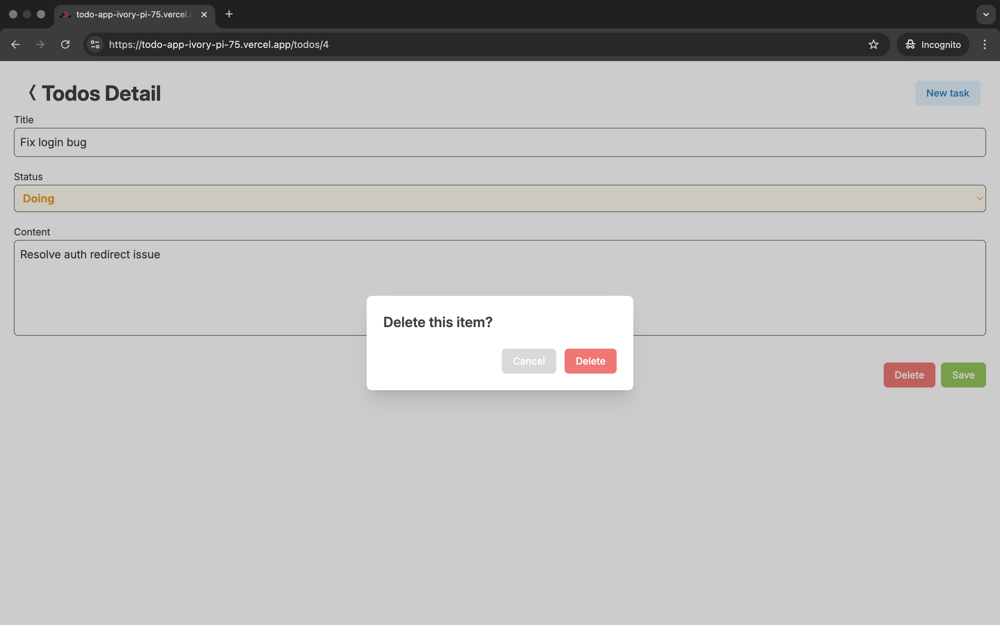
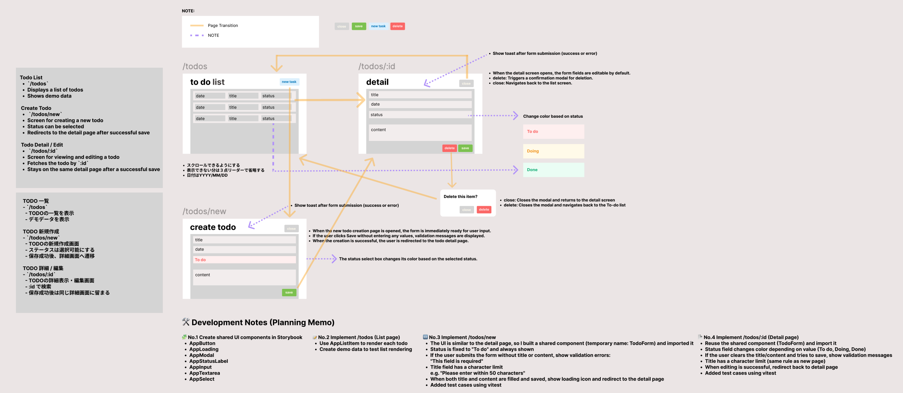

# 📝 設計・テスト・UI分離を意識したTodoアプリ

React Router v7 の Data API を活用し、実務に近い設計方針でアーキテクチャを構築しました。

## 📸 デモ

[Todo App](https://todo-app-ivory-pi-75.vercel.app/todos)

## 🧭 概要

React RouterのData API（loaderとaction）を使って、データの取得や更新をサーバーライクに実装しています。
UIコンポーネントは再利用性を重視し、Storybookで開発・管理しています。

## ⚙️ 使用技術

- **React 19**
- **React Router v7.10.1**
- **TypeScript**
- **React Hook Form** + **Zod**
- **Storybook v10.1.10**
- **Vitest** / **Testing Library**
- **GitHub Actions**（CI/CD）
- **Vercel** (Hosting / Deployment)

## ✨ 主な機能

- ✅ Todo一覧の表示
- 🆕 Todoの新規作成
- 🔍 Todoの詳細表示
  - 🗑️ Todoの削除
  - ✏️ Todoの更新

### 📋 Todo一覧（PC画面）

- Todoを表形式で一覧表示
- ステータスごとに色分けラベル
- 新規作成ボタンあり



### 📋 Todo一覧（SP画面）

- レスポンシブ対応
- モバイルでは1カラムに最適化



### 📝 Todo新規作成

- タイトル・ステータス・内容の入力
- バリデーション付き
- 保存ボタンで登録処理へ



### 🧾 Todo詳細・編集画面

- 編集可能なフォーム
- 削除・保存ボタン付き



### ⚠️ バリデーションエラー表示 (新規作成・詳細画面)

- 空欄時・制限オーバー時にエラー表示
- フィールド単位で明確に表示




### 🗑️ 削除モーダル

- Todo削除時の確認モーダル
- Cancel/Deleteボタンあり



## 🗺️ ルーティング構成

| ページ名 | パス         |
| -------- | ------------ |
| Todo一覧 | `/todos`     |
| Todo詳細 | `/todos/:id` |
| 新規作成 | `/todos/new` |

## 📁 ディレクトリ構成（概要）

```
app/
├── routes/        # ルーティング、loader、action
├── server/        # サーバーサイドのロジック（mock）
├── features/      # 機能別のUIロジック
├── utils/         # ユーティリティ関数
├── schemas/       # Zodによるバリデーション
├── types/         # 共通の型定義
├── constants/     # ドメイン定数
└── root.tsx       # アプリのエントリーポイント
```

※詳細は 👉 [📐 アーキテクチャと構成設計](#-アーキテクチャと構成設計) を参照

## 🧩 UIコンポーネント（Storybook）

Storybookで独立して開発された、再利用性の高いプレゼンテーションコンポーネント群。

```
stories/
├── button
├── input
├── select
├── textarea
├── modal
├── toast
├── loading
├── status-label
└── suspense
```

## 🏗️ アーキテクチャ

このアプリはReact RouterのData Routerアーキテクチャを採用し、
**ルーティング・サーバーロジック・UI描画**の責務を明確に分離しています。

## 📐 アーキテクチャと構成設計

設計思想・ディレクトリ構成の詳細はこちら：

📄 [docs/structure.md (English)](./structure.md)
📄 [docs/structure-ja.md (日本語)](./structure-ja.md)

## 🚀 セットアップ

```bash
git clone https://github.com/your-name/todo-app.git
cd todo-app
npm install
npm run dev
```

## 🧪 テストの実行

```bash
npm run test
```

- 単体テスト：`Vitest`
- コンポーネントテスト：`@testing-library/react`
- ルート単位のloader/actionのテストも実施
- 初期設定は setup-tests.ts に記載（jest-dom の拡張など）

## 🔄 CI / 品質保証

- GitHub Actions で PRごとにテストを自動実行
- マージ前に不具合を検知
- ESLint（Flat Config）を導入し、基本的なコード品質チェックもCIで実行
  - `no-unused-vars`, `prefer-const`, `eqeqeq`, `jsx-key` などの静的ルールを適用
  - TypeScript / React対応、再利用・保守性を意識したルール構成

## 🧼 Lintの実行（ESLint）

```
npx eslint .
```

- **ESLint Flat Config** を使って、JS/TS/Reactすべてに対応
- GitHub Actions上でも自動でLintチェックを実行

📄 [ESLintの設定を見る](/eslint.config.ts)

## 🧠 設計のポイント

- **🔗 loader / action = HTTPリクエスト処理**
  バックエンドのように `Response` を返す構造。

- **🧩 サーバーロジックの分離**
  `app/server/` にビジネスロジックを集約。

- **🖼️ UIは表示に専念**
  ロジックを持たない、再利用可能なコンポーネント。

### 🎨 UIライブラリについて

このアプリでは、UIはすべてTailwind CSSのみで構築しています（外部UIライブラリは未使用）。

MantineなどのUIフレームワークを使うことで開発効率は上がりますが、将来的なライブラリアップデートによる破壊的変更やバージョン不整合のリスクを避けるため、今回はTailwindのみでデザインを実装しました。

## 🔁 データフロー例：`/todos/new`

1. ユーザーが新しいTodoを作成
2. `action` がPOSTリクエストを受信
3. `create-task.ts` を実行
4. 成功時 → `/todos/:id` にリダイレクト
5. 失敗時 → 構造化されたエラーをUIに返す

## ✍️ 学んだこと

- **Remixライクな構成**でReactアプリを整理
- loader / action による **サーバー主導のデータ処理**
- 責務分離による **保守性・拡張性の向上**
- **Storybook中心のUI設計**
- **テスト可能な構成**の実践

### 🧾 設計図（Figma）

実装に入る前にUIの振る舞いをFigma上で可視化し、仕様を整理しました。

- 各ページの構造・役割
- ステータスやボタンの挙動
- Toast表示やモーダルなどのUI挙動も図示

🔗 [Figmaで作成した画面設計図を見る](https://www.figma.com/design/oBFz8dScJn1BJ1qdgsV4p4/TODO?node-id=0-1&t=ZTjQpuCXUlaOJeoS-1)



## 📄 Other Docs

- [🧭 Architecture (JA)](./structure-ja.md)
- [📘 README (JA)](./readme-ja.md)
